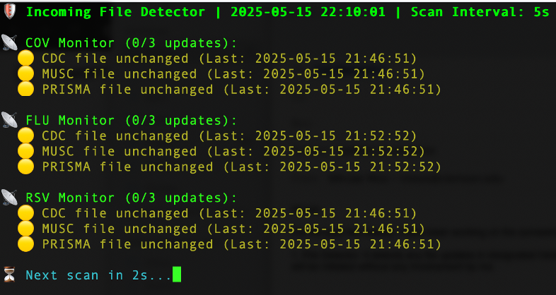
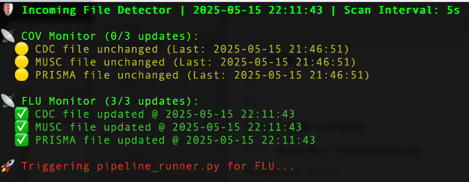
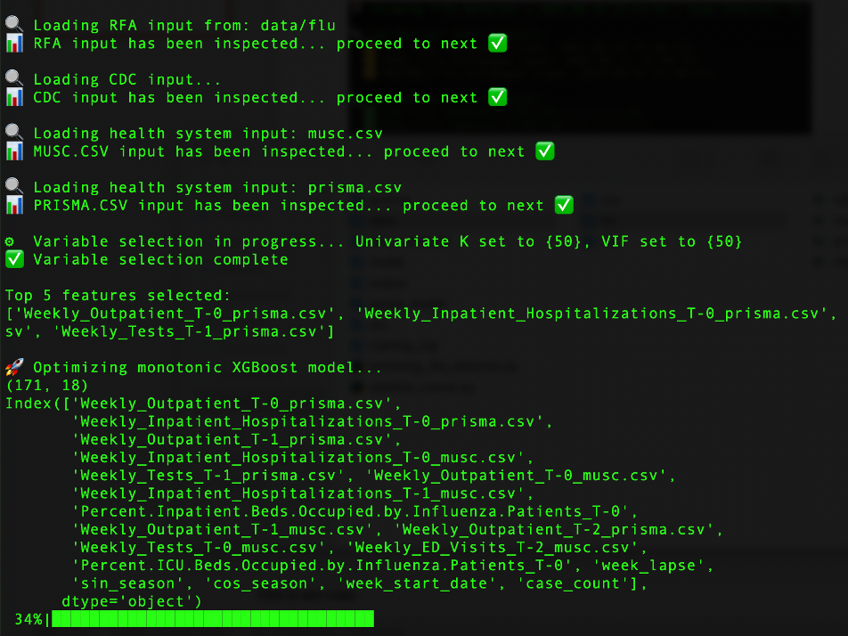
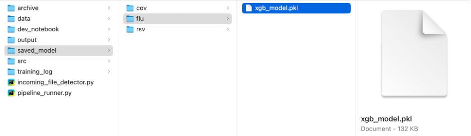
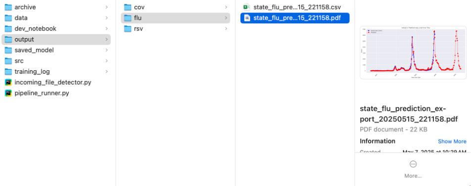
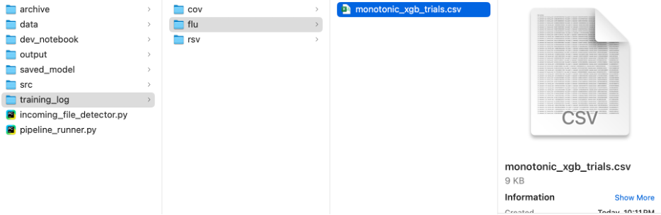
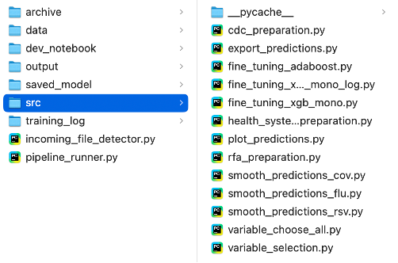

# PHMR Automation: End-to-End Forecasting Pipeline

This document outlines the prototype design and functionality of an automated modeling pipeline built to streamline the training process for disease forecasting models. The system consists of a lightweight, continuously running file detector paired with a modular training pipeline designed for reliability, scalability, and hands-off operation.

---

## 1. File Detector

It detects any file updates in designated folders. Once all three files (Prisma, MUSC, CDC) are present, it triggers the next step in the automated training process. In practice, whenever Iromi and Carolina update the files, the process will be initiated without any involvement by me.

**Figure 1.** By default, it examines changes every 5 seconds:

**Figure 2.** Once detected, it triggers model training pipeline for a targeted disease:

---

## 2. Model Training Pipeline

The pipeline displays basic inspection results for each data source and then passes those files to the variable selector. Once the selection is complete, XGBoost training will be performed with its monotonicity controlled. The trained model, lab book, inference output, and prediction plots will be saved in designated folders.

**Figure 3.** From inspection to model training:

**Figure 4.** From model training to prediction plot generation:

---

## 3. File Detector Loop

Once the process is complete, it will initiate the file detector again and start monitoring for changes every 5 seconds. It remembers the previous files, so if the files are replaced without any actual changes inside them, the training will not be initiated.

**Figure 5.** File detector is re-initiated with latest update times changed:

---

## 4. Generated Files

From the pipeline, the following files will be generated and saved:

**Figure 6.** Best model saved to `~/saved_model/flu`:

**Figure 7.** Predictions in CSV file and the corresponding plot saved to `~/output/flu`:

**Figure 8.** Training log (lab book) saved to `~/training_log/flu`:

**Figure 9.** All scripts have been organized, pipelined, and saved to `~/src`:

---

## Deployment Notes

In order to implement this on our server, we will need to request an exception for a very small node running 24/7 for file update detection. Once detected, it can request a larger node and run the rest of the process accordingly.
